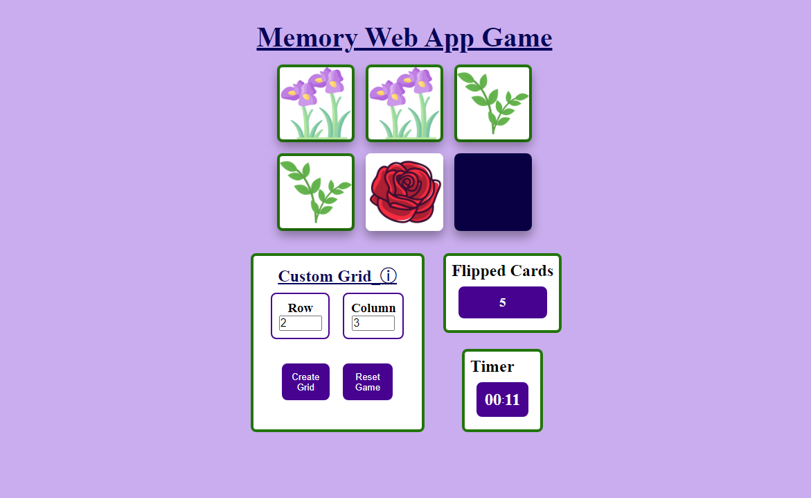

# Project Showcase: `Memory game web`

# How to install and run the project
In the project directory, you can run:
### `npm install`
### `npm run build`

## Overview

The game is being implemented using simple DOM elements without fancy graphics or canvas elements to focus on essential functionality. It allows only a single player to play on a pre-defined size board, with one set of symbols or images randomly hidden for matching. The development process follows Test-Driven Development (TDD) practices, with unit tests using mocks and spies to verify frontend updates based on game logic and player interactions. 

## Technologies Used

- **HTMl:** HyperText Markup Language, used for structuring the content of web pages.
- **JavaScript** To embed and play project videos.
- **CSS:** Custom styling for the overall appearance.
- **Jasmine** For testing the project.
- **Webpack** For bundling and managing dependencies.

## Contact

For any inquiries or questions, feel free to reach out to Tshediso at [tshedisoboshiana@gmail.com](mailto:tshedisoboshiana@gmail.com).

Other projects can be found at [projects](https://projects-5584f.web.app/)

Happy exploring! 🚀